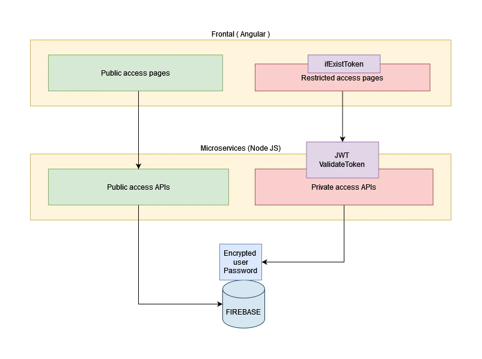
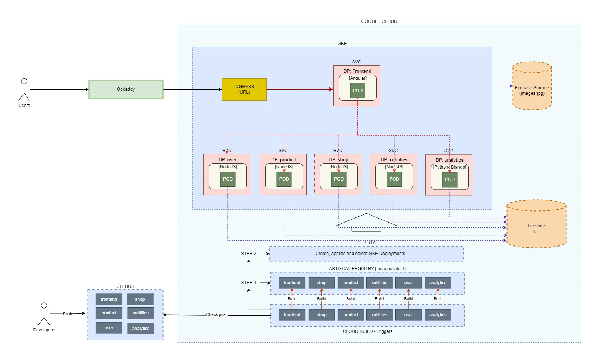
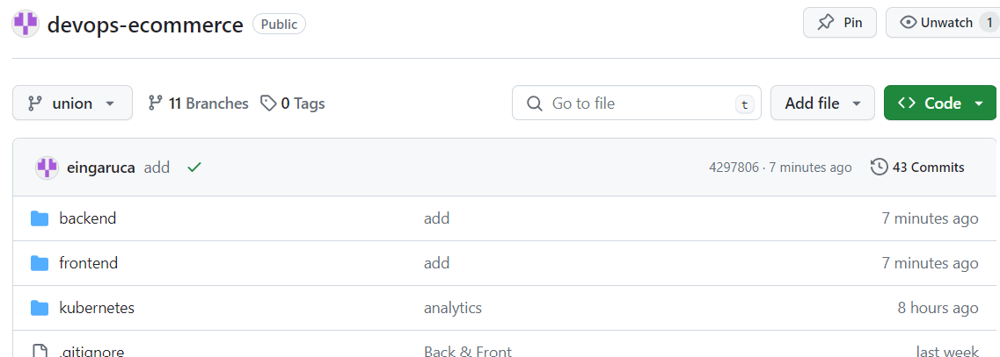
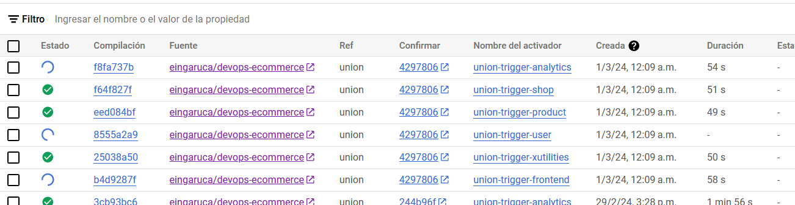
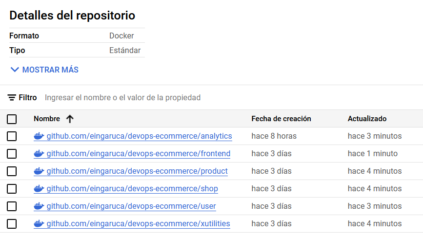
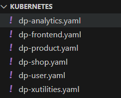
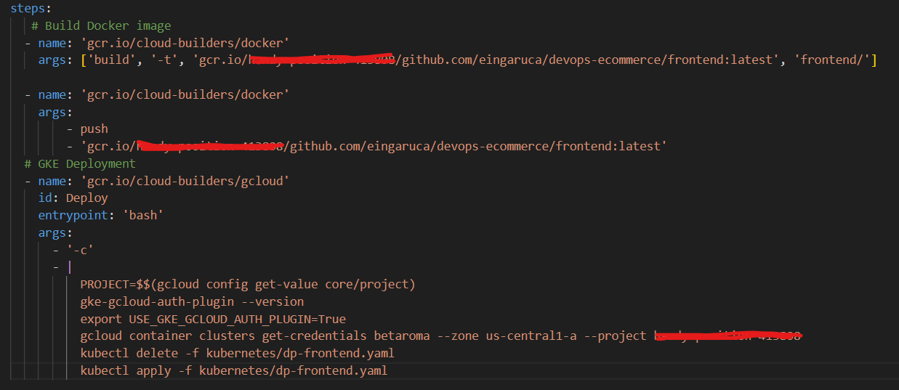
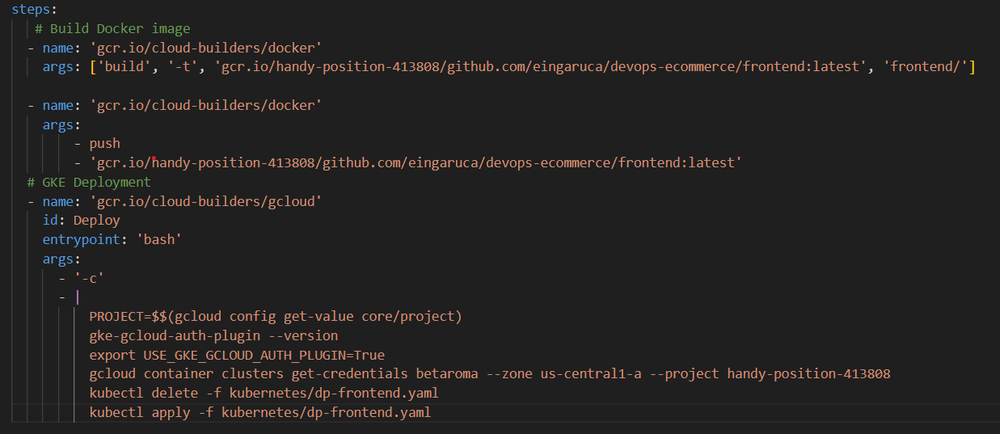
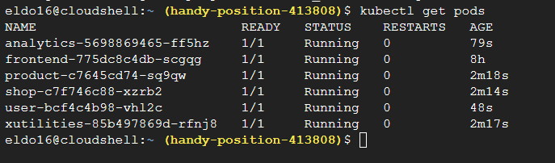

# BetAroma E-Shop

## 1. Proyecto 
   - Concepto: Un e-commerce especializado en la venta de perfumes comercial y de nicho, aquellos difíciles de encontrar en tiendas físicas o perfumerías tradicionales.
   - Público objetivo: Amantes de la perfumería, coleccionistas de fragancias, personas que buscan aromas únicos y diferenciadores.
   - Vamos a diseñar una plataforma e-commerce propia con un diseño atractivo, intuitivo y fácil de usar.

   
   
## 2. Integrantes equipo Beta:
   - Eldo Ingaruca
   - Andrés Bravo
   - Patricia García

## 3. Alcance
   El proyecto abarcará diferentes fases de un e-commerce real.
   - Módulo de Usuarios y opiniones
   - Módulo de Ventas
   - Módulo de Noticias/Novedades
   - Módulo de Pago
   - Módulo de estadísticas y recomendación (* Posible fase 2 *)

## 4. Software utilizado
- **Programming Languages**
  - **Frontend:**
    - Html / CSS
    - Angular 17
  - **Backend:**
    - NodeJS
    - Python - Django
- **Google Cloud Infraestructure**
  - Firestore Database (NoSQL)
  - Firebase Storage (Bucket)
  - Google Kubernetes Engine (GKE)
  - Cloud Build
  - Virtual Private Cloud (VPC)
- **Hosting**
  - GoDaddy

## 5. Web Site Overview

## 6. Google Cloud Architecture

## 7. CI / CD

- Push branch to github

- Triggers

- Artifact Registry:

- Yaml:

- Google Kubernetes Engine:

